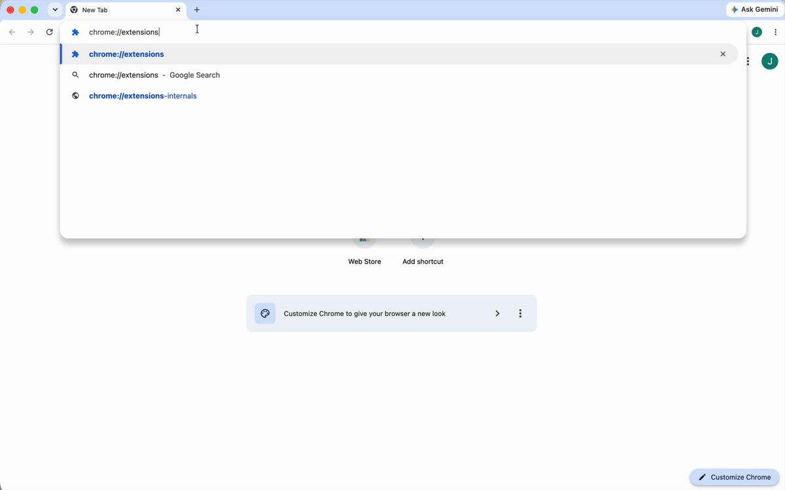
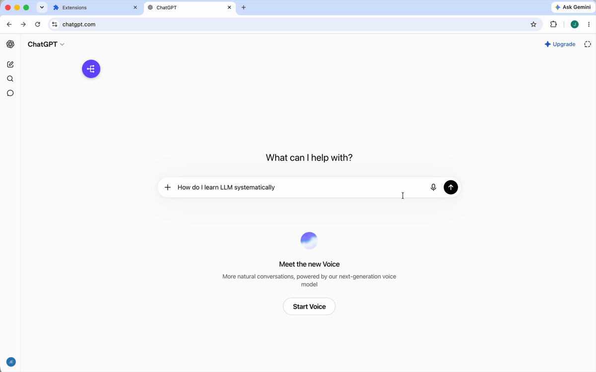

# ChatNotion

**From scattered chats to trees you explore and notes you keep — right inside ChatGPT.**

[](LICENSE)
[](manifest.json)
[](manifest.json)

ChatNotion is an open-source, account-free Chrome extension. No server, no tracking — everything stays local.

<p align="center">
  
</p>

<p align="center">
  <a href="https://jennieli101019-jpg.github.io/ChatNotion/"><strong>Website</strong></a> ·
  <a href="https://www.youtube.com/watch?v=AUSVUwdfqSs"><strong>Product Demo</strong></a> ·
  <a href="https://www.youtube.com/watch?v=brjVwq9LKvg"><strong>Demo + Build Story</strong></a>
</p>

<p align="center">
  
</p>

## What it is

- **Workspace** — Nest your ChatGPT chats into folders; drag, drop, and batch-move.
- **Knowledge trees** — Use Tree Mode to structure answers, generate expandable trees, and systematically learn any field.
- **Editable notes** — Open any chat, trim key ideas, highlight important lines, and add notes while keeping the original one click away.

## How to run it

ChatNotion works in Chrome and other Chromium-based browsers.

### 1. Clone the repository

```bash
git clone https://github.com/jennieli101019-jpg/ChatNotion.git
```

### 2. Load the extension in Chrome

1. Open `chrome://extensions` while signed in to your Google account.
2. Enable **Developer mode**.
3. Click **Load unpacked**.
4. Select:

   ```text
   ./dist/ChatNotion-1.0.0/
   ```

5. Confirm that ChatNotion appears in your extension list.
6. Open [ChatGPT](https://chatgpt.com). Refresh the page.
7. You should see the ChatNotion icon in the bottom-right corner of the ChatGPT interface.

<p align="center">
  
</p>

No Chrome Web Store account is required.

### 3. Try it in ChatGPT

For the full experience, sign in to your ChatGPT account before testing. Without signing in, your sessions aren't saved and you can't open explored nodes — but you can still try the knowledge tree generation and note editing features (they just won't persist or restore).

Ask ChatGPT a question you’d like to explore, such as: “How can I learn LLMs systematically?”, then:

1. Wait for the answer to finish.
2. Click **Generate tree** below the response.
3. Review the tree structure. If it is not organized clearly, open **Prompt Tools** next to the New Folder button and select **Tree Mode**. ChatNotion will automatically add a structure instruction to your original prompt and generate a clearer knowledge tree.
4. Open any node you want to explore.
5. Click Edit, highlight an important line, and add your own note.

<p align="center">
  
</p>

<table>
<tr>
<td>

<details>
<summary><strong>Example session: Learn LLMs systematically</strong></summary>

<br />

**You → ChatGPT**

> How should I systematically learn agentic AI?

Wait for the answer to finish. A **Generate tree** button appears below the response.

---

**Step 1 · Generate the knowledge tree**

Click **Generate tree** (pick a depth, e.g. *Depth 3*). ChatNotion turns the answer into a structured, expandable tree in the side panel. If the structure isn't clean, open **Prompt Tools** next to the New Folder button and select **Tree Mode** — ChatNotion adds a structure instruction to your prompt and regenerates a clearer tree.

---

**Step 2 · Explore a topic**

At first, only the parent node holds an explored question and answer. To go deeper into a child node:

1. Find the topic you want to learn.
2. Click the arrow button next to that node.
3. ChatNotion opens it in a new ChatGPT page, with the context and question prepared automatically.
4. Send the question to generate the answer.

---

**Step 3 · Open and edit a node**

Click any explored node's name to open its editable page. From there you can trim the answer to key ideas, highlight important lines, add your own notes, and jump back to the original ChatGPT answer in one click.

Your knowledge tree, highlights, and notes are all saved locally.

</details>

</td>
</tr>
</table>

## Built with GPT-5.6 and Codex

ChatNotion was built through a conversation-to-code loop, narrated in the [build story](https://www.youtube.com/watch?v=brjVwq9LKvg).

- **Codex accelerated the entire build.** It turned “organize my scattered GPT chats” into a working Shadow DOM panel, then implemented the testable core: Markdown and math parsing, outline extraction, a versioned tree model with migrations, prompt composition, and validated local backups — all with unit tests. Across multiple iterations, it refined the design, fixed bugs, and hardened local storage based on my testing feedback.
- **GPT-5.6** turned plain-language product questions into interface and architecture decisions, and helped reason through tradeoffs.
- I drove the idea, feature priorities, and testing cycles; Codex and GPT-5.6 handled implementation and iteration.

## Develop and build

<details>
<summary><strong>Run the checks and package a release</strong></summary>

<br />

You only need [Node.js](https://nodejs.org/) 20 or newer to run the checks and package a release.

Run the syntax checks and test suite:

```bash
bash scripts/check.sh
```

Package a release (writes the unpacked folder and a `.zip` under `dist/`):

```bash
bash scripts/build-release.sh
```

The release version is read from `manifest.json`, so bump the `version` field there before packaging.

</details>

## More

- **Architecture and internals:** [ARCHITECTURE.md](ARCHITECTURE.md)
- **Privacy:** No developer server, analytics, or remote code. See [PRIVACY.md](PRIVACY.md).
- **License:** MIT — see [LICENSE](LICENSE). ChatNotion bundles [KaTeX](https://katex.org/) under the MIT License.

